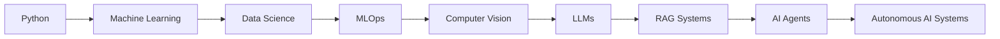

# <p align="center">⚡ POOJA MISHRA ⚡</p>

<p align="center">

</p>

<p align="center">

</p>

---

# 🧠 AI CONTROL CENTER

```yaml
━━━━━━━━━━━━━━━━━━━━━━━━━━━━━━━━━━━━━━━

Identity:
  Pooja Mishra

Role:
  AI Systems Engineer

Location:
  Gurugram,India 🇮🇳

Status:
  ONLINE 🟢

Mission:
  Building Intelligent Systems
  That Learn, Reason and Scale

Current Focus:
  - Large Language Models (LLMs)
  - Retrieval-Augmented Generation (RAG)
  - Computer Vision
  - MLOps
  - AI Agents

━━━━━━━━━━━━━━━━━━━━━━━━━━━━━━━━━━━━━━━
```

---

# ⚡ ABOUT ME

I am passionate about building **production-ready AI systems** that solve real-world problems.

My work combines:

🧠 Artificial Intelligence

📊 Data Science

⚙️ Machine Learning Engineering

🚀 MLOps & Cloud Deployment

🔍 Computer Vision

☁️ Scalable APIs

I enjoy transforming raw data into intelligent products that create measurable business impact.

---

# 🚀 CURRENT AI MISSIONS

```text
[✓] Production OCR Systems
[✓] End-to-End MLOps Pipelines
[✓] Cloud Deployment on GCP
[✓] REST APIs with FastAPI

[🚧] Retrieval-Augmented Generation (RAG)
[🚧] AI Agents
[🚧] LangGraph Workflows
[🚧] LLM Fine-Tuning

[🎯] Building Real-World AI Products
```

---

# 🛠 AI ARSENAL

### Programming


### Data Science


### AI & Deep Learning


### MLOps


### Cloud


---

# 🧬 AI EVOLUTION ROADMAP



---

# 🚀 FEATURED PROJECTS

## 🔹 Aadhaar OCR Automation Platform

Production-grade OCR API for extracting structured Aadhaar information.

Stack:

FastAPI • PaddleOCR • OpenCV • Docker • GCP Cloud Run

---

## 🔹 End-to-End MLOps Pipeline

Automated training, experiment tracking, CI/CD, and deployment.

Stack:

Python • MLflow • Jenkins • Docker • GCP

---

## 🔹 Hotel Reservation Cancellation Predictor

Machine Learning model for predicting hotel booking cancellations.

Stack:

LightGBM • Pandas • Scikit-Learn

---

# 📊 GITHUB ANALYTICS

<p align="center">


</p>

---

# 🧠 AI PHILOSOPHY

```python
class PoojaMishra:

    def mission(self):

        return """
        Build intelligent systems
        that transform data into decisions,
        automate complexity,
        and create real-world impact.
        """
```

---

# 🌐 CONNECT WITH ME

📧 [mpooja25@myyahoo.com](mailto:mpooja25@myyahoo.com)

💼 LinkedIn

💻 GitHub: github.com/Vijaylekha25

---

<p align="center">

### ⚡ BUILDING THE FUTURE WITH AI ⚡

*"The best way to predict the future is to build it."*

</p>


